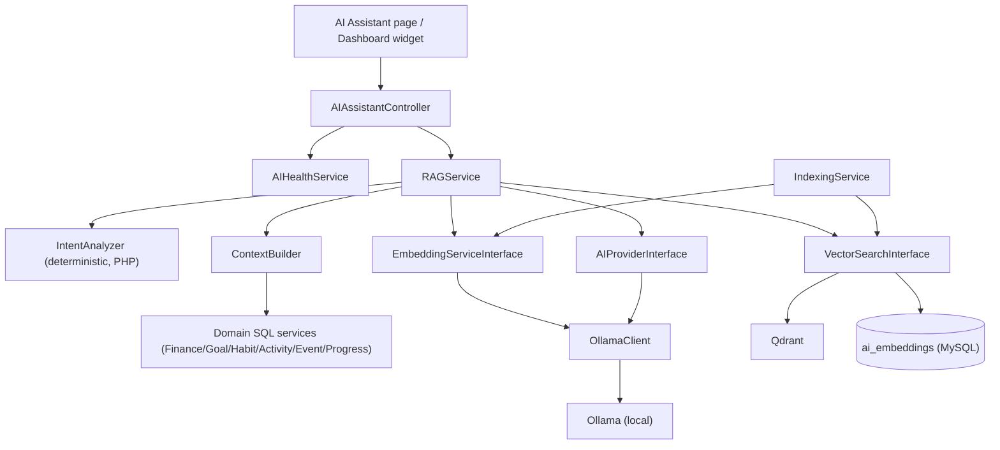
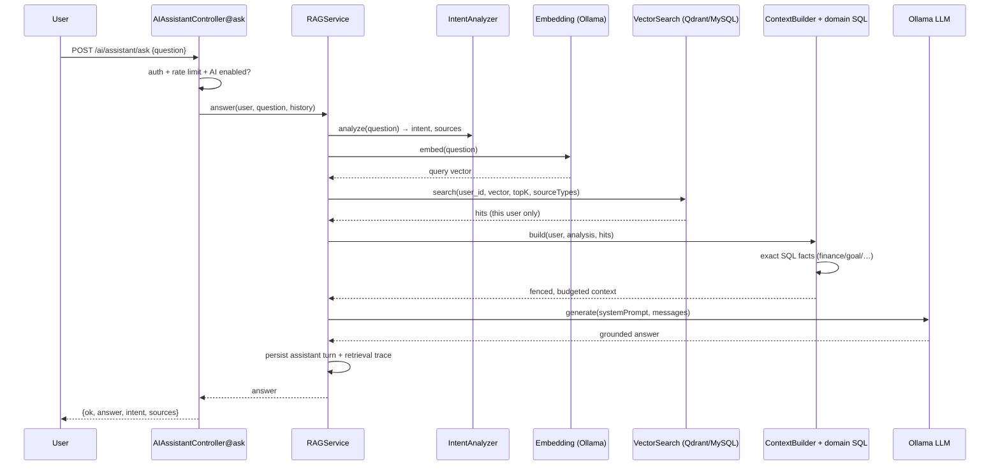
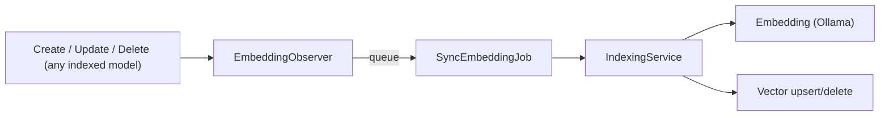

# Local AI Architecture

The AI Assistant is a **100% local, privacy-first** subsystem. It requires **no paid
AI API and no API key** — the LLM and the embedding model run on your own machine via
[Ollama](https://ollama.com), and vectors live in a self-hosted
[Qdrant](https://qdrant.tech) instance (or a MySQL fallback).

> **Never required:** OpenAI, Anthropic, Gemini, Azure, OpenRouter, or any hosted /
> paid AI or vector service.

---

## 1. Status of each part

| Component                   | Status                       | Notes                                                                 |
| --------------------------- | ---------------------------- | --------------------------------------------------------------------- |
| Local LLM (Ollama)          | Implemented                  | Model is configurable (`OLLAMA_MODEL`), hardware-aware auto-selection |
| Local embeddings (Ollama)   | Implemented                  | `OLLAMA_EMBEDDING_MODEL`, e.g. `nomic-embed-text`                     |
| Qdrant vector store         | Implemented                  | Default driver; graceful MySQL fallback                               |
| MySQL vector store          | Implemented                  | Zero-infrastructure fallback (`AI_VECTOR_DRIVER=database`)            |
| RAG pipeline                | Implemented                  | Intent → retrieval → context → generation                             |
| Semantic indexing + reindex | Implemented                  | Observers + `php artisan ai:reindex`                                  |
| AI conversations            | Implemented                  | `ai_conversations` / `ai_messages`                                    |
| AI health / status          | Implemented                  | `php artisan ai:health` + Settings → AI Status                        |
| Milvus vector store         | Configured (optional)        | Adapter exists behind `AI_VECTOR_DRIVER=milvus`; not the default      |
| OpenAI provider             | Configured (optional/legacy) | Adapter exists behind `AI_PROVIDER=openai`; **never required**        |
| Fine-tuning samples         | Planned / unused             | `AiTrainingSample` model + table exist; no code captures samples      |

---

## 2. High-level architecture

The LLM **never** queries the database and **never** calculates money. Laravel
retrieves and computes; the model only explains.

---

## 3. Components (file map)

All AI code lives in `app/Services/AI`.

| File                                      | Responsibility                                                                 |
| ----------------------------------------- | ------------------------------------------------------------------------------ |
| `RAGService.php`                          | Orchestrates the whole pipeline and persists conversation turns                |
| `IntentAnalyzer.php`                      | Deterministic classifier (which sources, structured vs semantic) — no LLM      |
| `ContextBuilder.php`                      | Runs SQL retrievals, merges semantic hits, fences untrusted text, budgets size |
| `IndexingService.php`                     | Builds the embeddable text per record; upsert/delete/reindex                   |
| `AIHealthService.php`                     | Health report (Healthy/Warning/Unavailable)                                    |
| `AIPrivacyService.php`                    | Indexing permission, secret/email redaction, DATA fencing                      |
| `Contracts/AIProviderInterface.php`       | LLM abstraction (`generate`, `chat`, `healthCheck`, `installedModels`)         |
| `Contracts/LLMProviderInterface.php`      | Legacy alias interface (`complete`)                                            |
| `Contracts/EmbeddingServiceInterface.php` | Embedding abstraction (`embed`, `embedMany`)                                   |
| `Contracts/VectorRepositoryInterface.php` | Vector store contract (legacy name)                                            |
| `Vector/VectorSearchInterface.php`        | Canonical vector store contract                                                |
| `Vector/QdrantVectorSearch.php`           | Qdrant adapter (REST) + MySQL mirror                                           |
| `Vector/DatabaseVectorRepository.php`     | MySQL-backed vector store (also the fallback)                                  |
| `Vector/MilvusVectorRepository.php`       | Optional Milvus adapter                                                        |
| `Ollama/OllamaClient.php`                 | The only place that speaks Ollama's wire protocol                              |
| `Ollama/ModelSelector.php`                | Hardware-aware model selection (excludes `:cloud` models)                      |
| `Hardware/HardwareDetector.php`           | RAM / CPU / GPU / disk probe                                                   |
| `Providers/OllamaAIProvider.php`          | Local LLM provider                                                             |
| `Providers/OllamaEmbeddingProvider.php`   | Local embedding provider                                                       |
| `Providers/NullLLMProvider.php`           | Deterministic offline LLM (tests / no runtime)                                 |
| `Providers/NullEmbeddingProvider.php`     | Deterministic hashed embeddings (tests)                                        |
| `Providers/OpenAIProvider.php`            | Optional legacy LLM adapter                                                    |
| `Providers/OpenAIEmbeddingProvider.php`   | Optional legacy embedding adapter                                              |
| `Services/FinanceAIService.php`           | Exact SQL finance figures per range                                            |
| `Services/ActivityAIService.php`          | Activity counts/durations per range                                            |
| `Services/GoalAIService.php`              | Goal progress + date math                                                      |
| `Services/HabitAIService.php`             | Real consistency figures (never fabricated streaks)                            |
| `Services/EventAIService.php`             | Events in a window                                                             |
| `Services/ProgressAIService.php`          | Recent progress updates/achievements                                           |
| `Exceptions/AIServiceException.php`       | Safe, secret-free failure type with reason codes                               |

Container bindings & observers: `app/Providers/AIServiceProvider.php`.

---

## 4. Request flow

### Response flow / grounding

- The **system prompt** instructs the model to use only the retrieved context, treat
  fenced content strictly as data, and never recompute numbers.
- The model's answer is trimmed to `AI_MAX_RESPONSE_CHARS`.
- The assistant turn is stored with a `metadata` trace (intent, range, sources,
  sections, model) so an answer is auditable back to real rows.

---

## 5. Prompt handling & prompt-injection defence

- All untrusted user text is passed through `AIPrivacyService::sanitizeUntrusted()`
  (redacts API-key-like strings and, optionally, e-mails) and wrapped by `fence()`
  in `<<DATA … DATA>>>` markers. Any attempt to close the fence early is neutralised.
- The system prompt (in `RAGService::systemPrompt()`) carries the highest priority
  and explicitly says the fenced content is data, not instructions.

---

## 6. Context handling

`ContextBuilder` assembles sections, selecting them from the classified intent:

| Section           | Source              | Contains                                                        |
| ----------------- | ------------------- | --------------------------------------------------------------- |
| FINANCE           | `FinanceAIService`  | Exact per-currency income/expense/salary/savings + top expenses |
| DAILY ACTIVITIES  | `ActivityAIService` | Counts, total minutes, time-by-category, recent rows            |
| GOALS             | `GoalAIService`     | Progress %, days elapsed/remaining, overdue                     |
| HABITS            | `HabitAIService`    | Consistency % over a window (real completions)                  |
| EVENTS            | `EventAIService`    | Events in the requested range                                   |
| PERSONAL PROGRESS | `ProgressAIService` | Recent progress updates, active categories                      |
| SEMANTIC          | vector search       | Top-K related records from the user's own index                 |
| CONTEXT META      | —                   | Today's date, default currency, timezone                        |

Size is bounded by `AI_MAX_CONTEXT_ITEMS` and `AI_MAX_CONTEXT_CHARS`.

---

## 7. Database integration & vector search

- **SQL is authoritative.** Every number is computed by SQL/Laravel.
- **Vector is an index only.** Rebuildable via `php artisan ai:reindex`.
- **What is indexed** (`IndexingService`): Daily Activities, Goals, Goal Progress,
  Habits, Events, and the _textual_ fields of finance records
  (`description`/`notes`/`source`/`category`/`name`). Exact totals are **not**
  indexed.
- **What is not indexed:** Routine items/occurrences (no source type), and secrets.
- **Every vector** carries `user_id`, `source_type`, `source_id`; every search is
  filtered by the authenticated user. There is no global semantic search.

---

## 8. Privacy considerations

- Data stays on the machine (Ollama + Qdrant are local).
- Per-user isolation is enforced in the vector store and re-checked on read
  (`QdrantVectorSearch` rejects a payload whose `user_id` differs).
- Secrets/e-mails are redacted before content reaches the model.
- `AIPrivacyService::canIndex()` requires both the global `AI_ENABLED` flag and the
  user's `ai_settings.semantic_indexing_enabled`.

---

## 9. Embedding synchronization

- Registered in `AIServiceProvider::boot()` **only when `AI_ENABLED=true`**.
- Async by default (`AI_SYNC_QUEUE=true`); inline when `AI_SYNC_SYNCHRONOUS=true`.
- **Failures are swallowed** — indexing can never break the CRUD operation.

---

## 10. Configuration & environment variables

Read in `config/ai.php` (defaults are safe).

| Variable                      | Default                  | Purpose                                           |
| ----------------------------- | ------------------------ | ------------------------------------------------- |
| `AI_ENABLED`                  | `false`                  | Master switch                                     |
| `AI_PROVIDER`                 | `ollama`                 | Provider driver (`ollama` \| `null` \| `openai`)  |
| `OLLAMA_BASE_URL`             | `http://127.0.0.1:11434` | Local LLM runtime URL                             |
| `OLLAMA_MODEL`                | `auto`                   | Chat model (auto = hardware-aware)                |
| `OLLAMA_EMBEDDING_MODEL`      | `auto`                   | Embedding model                                   |
| `OLLAMA_EMBEDDING_TIMEOUT`    | `60`                     | Embedding request timeout (s)                     |
| `OLLAMA_KEEP_ALIVE`           | `5m`                     | How long the model stays loaded                   |
| `AI_TIMEOUT`                  | `120`                    | Generation timeout (s)                            |
| `AI_AUTO_SELECT_MODEL`        | `true`                   | Use hardware-aware selection when model is `auto` |
| `AI_VECTOR_DRIVER`            | `qdrant`                 | Vector store (`qdrant` \| `database` \| `milvus`) |
| `QDRANT_URL`                  | `http://127.0.0.1:6333`  | Qdrant endpoint                                   |
| `QDRANT_COLLECTION`           | `life_management`        | Qdrant collection name                            |
| `QDRANT_API_KEY`              | —                        | Optional; empty for local                         |
| `QDRANT_TIMEOUT`              | `5`                      | Qdrant request timeout (s)                        |
| `QDRANT_DISTANCE`             | `Cosine`                 | Qdrant distance metric                            |
| `QDRANT_MIRROR_DATABASE`      | `true`                   | Mirror writes into `ai_embeddings`                |
| `AI_TOP_K`                    | `8`                      | Semantic results per query                        |
| `AI_MAX_CONTEXT_ITEMS`        | `20`                     | Max context items                                 |
| `AI_RETRIEVAL_MIN_SCORE`      | `0.15`                   | Minimum similarity                                |
| `AI_MAX_CONTEXT_CHARS`        | `12000`                  | Context byte budget                               |
| `AI_STRUCTURED_ROW_LIMIT`     | `50`                     | SQL rows per structured section                   |
| `AI_MAX_QUESTION_CHARS`       | `2000`                   | Question length cap                               |
| `AI_MAX_RESPONSE_CHARS`       | `8000`                   | Answer length cap                                 |
| `AI_RATE_LIMIT_PER_MINUTE`    | `20`                     | Per-user throttle                                 |
| `AI_HISTORY_MESSAGES`         | `6`                      | Prior turns sent to the model                     |
| `AI_SYNC_QUEUE`               | `true`                   | Queue embedding sync                              |
| `AI_SYNC_SYNCHRONOUS`         | `false`                  | Inline sync fallback                              |
| `AI_QUEUE_NAME`               | `default`                | Queue used by `SyncEmbeddingJob`                  |
| `AI_REDACT_EMAIL`             | `true`                   | Redact e-mails before model                       |
| `AI_MAX_RECORDS_PER_SOURCE`   | `25`                     | Per-source cap                                    |
| `AI_COLLECT_TRAINING_SAMPLES` | `false`                  | Unused scaffolding                                |

Hardware-model mapping lives in `config/ai.php` under `hardware`.

---

## 11. Commands

| Command                                      | Purpose                                     |
| -------------------------------------------- | ------------------------------------------- |
| `php artisan ai:health [--user=]`            | Health report + installed models + hardware |
| `php artisan ai:reindex [--user=] [--force]` | Rebuild the semantic index from MySQL       |

---

## 12. Graceful degradation

If Ollama or the vector store is offline, `AIServiceException` is thrown with a safe
message (e.g. _"Local AI is currently unavailable. Please start Ollama and try
again."_). The rest of the application is completely unaffected. The vector layer
additionally falls back to the MySQL store, and retrieval failures degrade the answer
to SQL-only rather than erroring.

---

## 13. Known limitations

- Routine data is **not** semantically indexed.
- Finance totals are intentionally **not** embedded (SQL only) — semantic search over
  finance covers textual notes/categories only.
- CPU-only inference is slow for larger models.
- `ai_training_samples` / fine-tuning is unused scaffolding.
- The Milvus and OpenAI adapters are present but not the default path.
