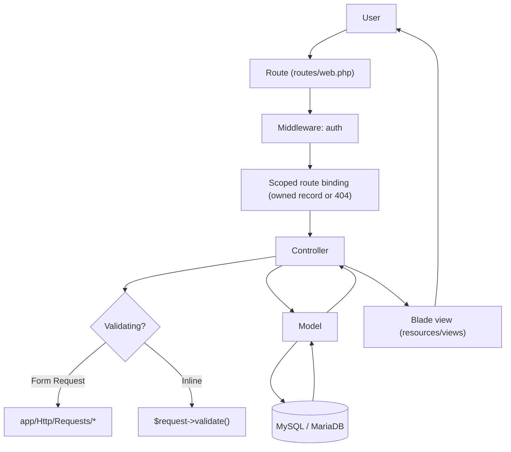
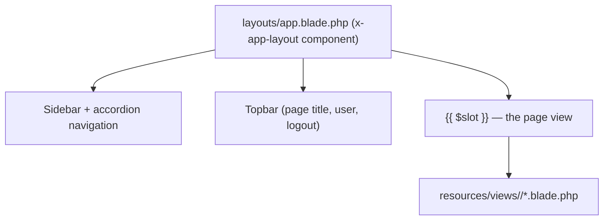
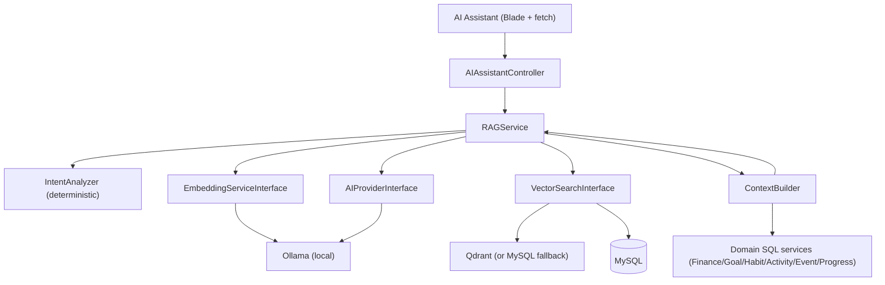

# Architecture

This document describes **how the Life Management System is actually built**.

---

## 1. Stack

| Layer     | Technology                                                                                                                 |
| --------- | -------------------------------------------------------------------------------------------------------------------------- |
| Framework | Laravel 12 (PHP 8.2+)                                                                                                      |
| Database  | MySQL / MariaDB                                                                                                            |
| Frontend  | Blade templates + a hand-written CSS design system (`resources/css/app.css`)                                               |
| JS        | Vite entry point (`resources/js/app.js`) + small inline `<script>` blocks in layouts for sidebar/accordion and the AI chat |
| Auth      | Laravel session guard (`Auth::attempt`) — no Jetstream/Breeze/Fortify                                                      |
| Local AI  | Ollama (LLM + embeddings), Qdrant (vector DB), custom RAG in `app/Services/AI`                                             |

There is **no** Tailwind utility styling in the views, no Alpine.js, and no Livewire.
The UI is server-rendered Blade using semantic CSS classes (`.card`, `.summary-card`,
`.nav-link`, `.btn-primary`, …) defined in `resources/css/app.css`.

---

## 2. Layer responsibilities

| Layer              | Folder                 | Responsibility                                                                                                                            |
| ------------------ | ---------------------- | ----------------------------------------------------------------------------------------------------------------------------------------- |
| Routing            | `routes/web.php`       | Maps URLs to controllers; all app routes are behind `auth`                                                                                |
| HTTP / Controllers | `app/Http/Controllers` | Handle a request, resolve the authenticated user (or an owned route model), query/update via models, return a view or redirect            |
| Form Requests      | `app/Http/Requests`    | Validation + light authorization for settings/profile/password flows                                                                      |
| Models             | `app/Models`           | Eloquent models, relationships, scopes, casts and small domain helpers (e.g. `Goal::daysRemaining()`, `DailyActivity::resolveDuration()`) |
| Support            | `app/Support`          | Cross-cutting helpers: `CurrencyConfig`, `MoneyFormatter`, `UserPreference`, global `helpers.php` (`money()`, `user_date()`, …)           |
| Policies           | `app/Policies`         | Ownership authorization for the modules that need per-record checks                                                                       |
| Providers          | `app/Providers`        | `AppServiceProvider` (policies, scoped route bindings) and `AIServiceProvider` (AI container bindings + model observers)                  |
| AI Services        | `app/Services/AI`      | The entire local AI stack (see [AI.md](./AI.md))                                                                                          |
| Views              | `resources/views`      | Blade templates and the shared app layout component                                                                                       |

### A note on "services"

This project intentionally uses **thin controllers + rich models + `App\Support`
helpers** for its CRUD modules. Finance, Goals, Habits, Activities, Events, Routine
and Settings do **not** have dedicated service classes — the business rules live in
the controllers and models, which is sufficient for this scope.

A dedicated service layer exists **only** for the AI subsystem
(`app/Services/AI/**`), where the logic is genuinely complex and reusable. Per the
project's engineering rules, service folders are **not** created for features that
do not need them.

---

## 3. Request lifecycle (standard module)

Every normal page/action follows this path:



- **Create/Update** flows validate input (either via a `FormRequest` or inline
  `$request->validate()`), write through the model, then redirect with a
  `session('status')` flash message.
- **List** flows query through the user's relationship (`$request->user()->…`) so
  results are always user-scoped.

---

## 4. Authorization & user isolation

Two mechanisms guarantee a user can only ever touch their own data:

1. **Relationship-based queries.** Almost every read/write goes through
   `$request->user()->expenses()` (etc.), so the `user_id` filter is implicit.
2. **Scoped route bindings.** In `AppServiceProvider::boot()` several route
   parameters are bound to the current user:

    ```php
    Route::bind('savingsGoal', fn ($v) => SavingsGoal::where('user_id', auth()->id())->findOrFail($v));
    Route::bind('transaction',  fn ($v) => SavingsTransaction::where('user_id', auth()->id())->findOrFail($v));
    Route::bind('activity',     fn ($v) => HabitActivity::where('user_id', auth()->id())->findOrFail($v));
    Route::bind('occurrence',   fn ($v) => RoutineOccurrence::where('user_id', auth()->id())->findOrFail($v));
    Route::bind('dailyActivity',fn ($v) => DailyActivity::where('user_id', auth()->id())->findOrFail($v));
    Route::bind('progressUpdate',fn($v) => GoalProgressUpdate::where('user_id', auth()->id())->findOrFail($v));
    Route::bind('conversation', fn ($v) => AiConversation::where('user_id', auth()->id())->findOrFail($v));
    ```

    A cross-user id therefore produces a **404 before the controller runs**.

3. **Policies.** `Gate::policy(...)` maps each model to a policy that checks
   `$model->user_id === $user->id`. See [SECURITY.md](./SECURITY.md).

---

## 5. Database architecture

MySQL/MariaDB is the **single source of truth**. Tables are grouped as:

- **Auth & platform**: `users`, `cache`, `cache_locks`, `jobs`, `job_batches`,
  `failed_jobs`, `sessions` (Laravel defaults).
- **Settings**: `settings`, `currencies`.
- **Finance**: `income_records`, `expense_records`, `savings_goals`,
  `savings_transactions`, `recurring_transactions`, `salaries`.
- **Personal modules**: `daily_activities`, `habits`, `habit_completions`,
  `habit_activities`, `routine_items`, `routine_occurrences`, `goals`,
  `goal_progress_updates`, `events`.
- **AI**: `ai_conversations`, `ai_messages`, `ai_embeddings`, `ai_settings`,
  `ai_training_samples`.
- **Legacy / orphaned**: `tasks`, `work_logs` — the tables still exist in the
  database but **no model or code references them** (Daily Activities replaced
  them). See [DATABASE.md](./DATABASE.md#legacy-tables).

Full column/relationship reference: [DATABASE.md](./DATABASE.md).

---

## 6. Frontend / UI architecture



- Every page is wrapped by the anonymous component `<x-app-layout>` whose template
  is `resources/views/layouts/app.blade.php`.
- The layout reads the user's appearance settings (`Setting`) to apply theme,
  primary colour and compact mode.
- Pages set a title/page-title via `<x-slot name="title">` and
  `<x-slot name="pageTitle">`.

Details: [UI.md](./UI.md).

---

## 7. AI architecture

The AI layer is a self-contained subsystem under `app/Services/AI`, resolved
entirely through interfaces so the vendor (Ollama/Qdrant) can be swapped from
configuration.



Key rule: **the LLM never queries the database and never calculates money.** Laravel
retrieves and computes; the model only explains. Full detail: [AI.md](./AI.md).

---

## 8. External / local dependencies

| Dependency           | Required?    | Notes                                                                  |
| -------------------- | ------------ | ---------------------------------------------------------------------- |
| MySQL/MariaDB        | Yes          | Source of truth                                                        |
| Ollama               | Yes (for AI) | Local LLM + embeddings; no API key                                     |
| Qdrant               | Optional     | Default vector driver; the app falls back to the MySQL store if absent |
| OpenAI/other AI APIs | **No**       | Never required                                                         |

---

## 9. Extension points

- **Add a module**: follow the pattern in [DEVELOPMENT.md](./DEVELOPMENT.md) and the
  [feature template in FEATURES.md](./FEATURES.md).
- **Swap the LLM/embeddings**: change `AI_PROVIDER` / the provider config.
- **Swap the vector store**: change `AI_VECTOR_DRIVER`; implement
  `VectorSearchInterface` for a new engine.
