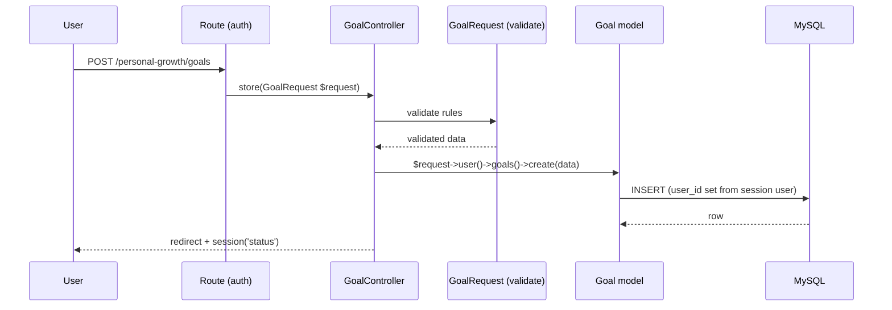

# Backend Reference

This document describes the **actual** backend: routes, controllers, requests,
models, policies, middleware and how data flows.

---

## 1. Responsibilities at a glance

| Component                               | Responsibility                                                                                              |
| --------------------------------------- | ----------------------------------------------------------------------------------------------------------- |
| **Route** (`routes/web.php`)            | URL → controller mapping, `auth`/`guest` middleware, scoped route bindings                                  |
| **Controller** (`app/Http/Controllers`) | Handle the request, resolve the user or an owned model, query/write via Eloquent, return a view or redirect |
| **Form Request** (`app/Http/Requests`)  | Validation (+ light authorization) for the modules that use them                                            |
| **Model** (`app/Models`)                | Data representation, relationships, scopes, casts and domain helpers                                        |
| **Policy** (`app/Policies`)             | Per-record ownership checks (`$model->user_id === $user->id`)                                               |
| **Middleware** (`app/Http/Middleware`)  | `ApplyUserPreferences` sets the user's timezone for the request                                             |
| **Support** (`app/Support`)             | `CurrencyConfig`, `MoneyFormatter`, `UserPreference`, global helpers                                        |

There is **no** service layer for the CRUD modules — logic lives in controllers +
models. A service layer exists only for AI (`app/Services/AI`). See
[ARCHITECTURE.md](./ARCHITECTURE.md#a-note-on-services).

---

## 2. Routes

All application routes are defined in `routes/web.php`. Console-only routing lives
in `routes/console.php`.

- **Public (guest)**: `GET/POST /register`, `GET/POST /login`.
- **Root** `GET /`: redirects to `dashboard` (auth) or `login` (guest).
- **Protected** (`Route::middleware('auth')`): everything else, including the AI
  Assistant and Settings.

Route **names** follow module prefixes (`income.*`, `expenses.*`, `habits.*`,
`goals.*`, `daily-activities.*`, `routine.*`, `events.*`, `calendar.index`,
`settings.*`, `ai.*`). The full list is in [API.md](./API.md).

### Scoped route bindings

Several route parameters are bound in `AppServiceProvider::boot()` to the current
user, so a cross-user id 404s before the controller runs:
`savingsGoal`, `transaction`, `activity`, `occurrence`, `dailyActivity`,
`progressUpdate`, `conversation`.

---

## 3. Controllers

All controllers live in `app/Http/Controllers`.

| Controller                                                                                                         | Module                     |
| ------------------------------------------------------------------------------------------------------------------ | -------------------------- |
| `Auth/LoginController`, `Auth/RegisterController`                                                                  | Authentication             |
| `DashboardController`                                                                                              | Dashboard overview         |
| `MoneyManagementController`                                                                                        | Money Management analytics |
| `IncomeController`, `ExpenseController`, `SalaryController`, `SavingsController`, `RecurringTransactionController` | Finance CRUD               |
| `DailyActivityController`                                                                                          | Daily Activities           |
| `HabitController`, `HabitActivityController`                                                                       | Habits + activities        |
| `RoutineItemController`, `RoutineOccurrenceController`                                                             | Daily Routine              |
| `GoalController`, `GoalProgressUpdateController`, `ProgressController`                                             | Goals + progress           |
| `EventController`, `CalendarController`                                                                            | Events + calendar          |
| `SettingsController`, `CurrencyController`                                                                         | Settings                   |
| `AIAssistantController`                                                                                            | Local AI Assistant         |

### Validation style (important for accuracy)

- The **settings/profile/password** flows and the **personal modules** use
  **Form Requests** (`app/Http/Requests`, 18 files) — e.g. `DailyActivityRequest`,
  `GoalRequest`, `HabitRequest`, `EventRequest`, `RoutineItemRequest`,
  `SavingsGoalRequest`, `CurrencyRequest`, `PasswordUpdateRequest`.
- The **finance CRUD controllers** (Income, Expense, Salary, Savings, Recurring)
  validate **inline** with `$request->validate([...])`. There are no Form Request
  classes for them.

---

## 4. Form Requests

`app/Http/Requests` contains:

`AppearanceSettingsRequest`, `CurrencyRequest`, `CurrencySettingsRequest`,
`DailyActivityRequest`, `EventRequest`, `FinanceSettingsRequest`,
`GeneralSettingsRequest`, `GoalProgressUpdateRequest`, `GoalRequest`,
`HabitActivityRequest`, `HabitRequest`, `NotificationSettingsRequest`,
`PasswordUpdateRequest`, `ProfileUpdateRequest`, `RoutineItemRequest`,
`RoutineOccurrenceRequest`, `SavingsGoalRequest`, `SavingsTransactionRequest`.

Each exposes `rules()` (and `authorize()` where relevant). They are injected into
controller methods, so validation runs **before** the action body.

---

## 5. Models

`app/Models` (23 models). Each module model:

- defines `$fillable` (mass-assignment protection),
- defines `casts()` (dates, decimals, enums),
- exposes the `user` relationship and domain helpers.

Notable domain helpers (used by the dashboard and the AI layer):

| Model           | Helpers                                                                                                                       |
| --------------- | ----------------------------------------------------------------------------------------------------------------------------- |
| `Goal`          | `progressPercentage()`, `daysElapsed()`, `daysRemaining()`, `durationInDays()`, `isOverdue()`, scopes `active()`, `overdue()` |
| `DailyActivity` | `resolveDuration()`, `durationLabel()`, `startTimeLabel()`                                                                    |
| `SavingsGoal`   | `progressPercentage()`, `remainingAmount()`                                                                                   |
| `Habit`         | `isCompletedOn()`, `hasActivities()`, `daysTracked()`                                                                         |
| `Event`         | `statusLabel()`, scopes `upcoming()`, `past()`                                                                                |
| `Setting`       | `forUser()` (lazy create)                                                                                                     |
| `Currency`      | `defaultFor()`, catalog constants                                                                                             |
| `User`          | relationships to every module + AI                                                                                            |

---

## 6. Policies & middleware

- **Policies** (`app/Policies`, 12 files) are registered in
  `AppServiceProvider::boot()` via `Gate::policy(...)`. Each checks ownership.
  See [SECURITY.md](./SECURITY.md).
- **Middleware**:
    - Laravel `auth` / `guest` guard the route groups.
    - `ApplyUserPreferences` (`app/Http/Middleware/ApplyUserPreferences.php`) sets
      the user's timezone for the duration of the request.

---

## 7. Data flow

**Typical write (e.g. create a goal):**

**Typical read (list):** controller queries `$request->user()->relation()` (implicit
`user_id` filter), paginates with `withQueryString()`, returns a Blade view.

**Delete:** a scoped route binding resolves the owned record (404 otherwise), the
controller authorizes where a policy exists, deletes, and redirects.

---

## 8. Error handling

- Validation failures throw `ValidationException` → redirected back with errors
  (`$errors` available in views).
- Ownership failures throw `ModelNotFoundException` → **404**.
- The AI layer converts every failure into a safe `AIServiceException` with a
  user-friendly message (see [AI.md](./AI.md)); the rest of the app is unaffected.
