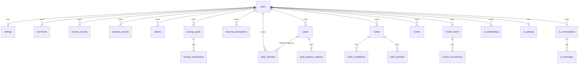

# Database Reference

**MySQL/MariaDB is the single source of truth.** All data is scoped to a `user_id`;
a user can only ever read or write rows they own.

The tables are created by the migrations in `database/migrations/`. The full,
machine-verified column listing (generated directly from the live schema) is at the
bottom of this document — nothing here is invented.

---

## Entity relationships (overview)

---

## Auth & platform tables

### `users`

- **Purpose**: Authenticated account. One row per person.
- **Key columns**: `name`, `email` (unique), `password`, `salary` (legacy single-salary field kept for backward compatibility), `profile_photo_path`.
- **Model**: `App\Models\User`
- **Relationships**: has many of every personal module; has one `Setting` and one `AiSetting`.
- **Migration**: `0001_01_01_000_create_users_table.php`

### `sessions`, `cache`, `cache_locks`, `jobs`, `job_batches`, `failed_jobs`, `password_reset_tokens`

- **Purpose**: Standard Laravel infrastructure tables (session storage, cache store, queue tables).
- **Notes**: The app uses `SESSION_DRIVER=database`, `CACHE_STORE=database`, `QUEUE_CONNECTION=database`. No custom code models these.

---

## Settings

### `settings`

- **Purpose**: One row per user holding every settings section (general, currency, salary, savings, income, expense, recurring, notifications, appearance). The master **currency** configuration lives here (`currency_code`, `currency_symbol`, …) and is the authoritative currency for the workspace.
- **Model**: `App\Models\Setting` (`Setting::forUser($id)` lazily creates the row)
- **Relationships**: belongs to `User`.
- **Migration**: `2026_09_17_100005_create_settings_table.php`

### `currencies`

- **Purpose**: Per-user currency registry (a user may define several currencies).
- **Key columns**: `name`, `code`, `symbol`, `decimal_precision`, `is_active`, `is_default`.
- **Constraints**: unique `(user_id, code)`.
- **Model**: `App\Models\Currency`
- **Migration**: `2026_09_17_100007_create_currencies_table.php`

---

## Finance tables

### `income_records`

- **Purpose**: Additional income entries.
- **Key columns**: `amount`, `date`, `description`, `source`, `category`, `notes`, `currency_code`, `currency_id`.
- **Model**: `App\Models\IncomeRecord`
- **Migration**: `2026_09_17_100006_create_income_records_table.php`

### `expense_records`

- **Purpose**: Expense entries.
- **Key columns**: `amount`, `date`, `description`, `notes`, `currency_code`, `currency_id`.
- **Model**: `App\Models\ExpenseRecord`
- **Migration**: `2026_09_17_100006_create_expense_records_table.php`

### `salaries`

- **Purpose**: Recurring salary definitions (multiple allowed; active ones sum into monthly salary).
- **Key columns**: `name`, `amount`, `amount_type`, `frequency`, `payment_day`, `is_active`, `currency_code`.
- **Model**: `App\Models\Salary`
- **Migration**: `2026_09_17_100006_create_salaries_table.php`

### `savings_goals`

- **Purpose**: Savings goals/accounts a user saves toward (multiple per user).
- **Key columns**: `name`, `description`, `target_amount`, `current_amount`, `start_date`, `target_date`, `status` (`active|completed|paused`), `currency_code`.
- **Model**: `App\Models\SavingsGoal` (`progressPercentage()`, `remainingAmount()`)
- **Migration**: `2026_09_17_100006_create_savings_goals_table.php` + `2026_09_18_100001_extend_savings_goals_table.php`

### `savings_transactions`

- **Purpose**: Ledger of deposits/withdrawals against a savings goal.
- **Key columns**: `savings_goal_id`, `type`, `amount`, `date`, `description`.
- **Model**: `App\Models\SavingsTransaction`
- **Migration**: `2026_09_18_100002_create_savings_transactions_table.php`

### `recurring_transactions`

- **Purpose**: Recurring income/expense templates.
- **Key columns**: `type` (`income|expense`), `amount`, `frequency`, `next_due_date`, `is_active`, `currency_code`.
- **Model**: `App\Models\RecurringTransaction`
- **Migration**: `2026_09_18_100004_create_recurring_transactions_table.php`

---

## Personal module tables

### `daily_activities`

- **Purpose**: Personal journal of what the user actually did each day. (Replaced the former Tasks + Work Logs modules.)
- **Key columns**: `title`, `description`, `activity_date`, `start_time`, `end_time`, `duration_minutes`, `category`, `status` (`completed|in_progress|planned|skipped`), `goal_id` (nullable link to a goal).
- **Model**: `App\Models\DailyActivity` (`resolveDuration()`, `durationLabel()`)
- **Relationships**: belongs to `User`; belongs to `Goal` (optional).
- **Migration**: `2026_09_18_100005_create_daily_activities_table.php`

### `goals`

- **Purpose**: Personal goals, measurable or qualitative.
- **Key columns**: `title`, `description`, `start_date`, `target_date`, `target_value`, `target_amount`, `current_amount`, `progress`, `progress_type` (`measurable|qualitative`), `priority`, `status` (`not_started|in_progress|completed|paused|cancelled`), `completed_at`, `notes`.
- **Model**: `App\Models\Goal` (`progressPercentage()`, `daysElapsed()`, `daysRemaining()`, `isOverdue()`, scopes `active()`/`overdue()`)
- **Migration**: `2026_09_18_100006_create_goals_table.php`

### `goal_progress_updates`

- **Purpose**: Dated progress history for a goal.
- **Key columns**: `goal_id`, `date`, `description`, `progress_value`, `time_spent_minutes`, `notes`.
- **Model**: `App\Models\GoalProgressUpdate`
- **Migration**: `2026_09_18_100007_create_goal_progress_updates_table.php`

### `habits`

- **Purpose**: Habits the user tracks.
- **Key columns**: `title`, `description`, `frequency` (`daily|weekly|custom`), `start_date`, `status` (`active|paused|completed`).
- **Model**: `App\Models\Habit`
- **Migration**: `2026_09_18_100008_create_habits_table.php`

### `habit_completions`

- **Purpose**: One row per habit completion day (optional per-activity).
- **Key columns**: `habit_id`, `habit_activity_id` (nullable), `completed_date`, `notes`.
- **Model**: `App\Models\HabitCompletion`
- **Migration**: `2026_09_18_100008_create_habits_table.php`

### `habit_activities`

- **Purpose**: Independently trackable sub-activities within a habit (e.g. five prayers).
- **Key columns**: `habit_id`, `name`, `sort_order`, `is_active`.
- **Model**: `App\Models\HabitActivity`
- **Migration**: `2026_09_18_100009_create_habit_activities_table.php`

### `routine_items`

- **Purpose**: Daily-routine **templates** (e.g. "Study English").
- **Key columns**: `title`, `description`, `start_time`, `end_time`, `recurrence_type` (`one_time|daily|weekly|monthly|custom_days|interval`), `interval_days`, `days_of_week`, `start_date`, `end_date`, `status`.
- **Model**: `App\Models\RoutineItem`
- **Migration**: `2026_09_18_100010_create_routine_items_table.php` + `2026_09_18_100003_extend_routine_items_and_create_occurrences.php`

### `routine_occurrences`

- **Purpose**: Per-day occurrence history for a routine template (independent status per day).
- **Key columns**: `routine_item_id`, `occurrence_date`, `status` (`pending|completed|skipped`), `notes`, `completed_at`.
- **Constraints**: unique `(routine_item_id, occurrence_date)`.
- **Model**: `App\Models\RoutineOccurrence`
- **Migration**: `2026_09_18_100003_extend_routine_items_and_create_occurrences.php`

### `events`

- **Purpose**: Personal events/appointments shown on the calendar.
- **Key columns**: `title`, `description`, `event_date`, `start_time`, `end_time`, `location`, `notes`, `status` (`upcoming|completed|cancelled`).
- **Model**: `App\Models\Event` (scopes `upcoming()`, `past()`)
- **Migration**: `2026_09_18_100011_create_events_table.php`

---

## AI tables (derived — not authoritative)

> The AI tables support retrieval only. **MySQL personal records are the source of
> truth**; the AI index is rebuildable with `php artisan ai:reindex`.

### `ai_conversations`

- **Purpose**: Persistent AI chat conversations, one owner each.
- **Key columns**: `title`, `context_type`, `context_ref_type`, `context_ref_id`, `message_count`, `last_message_at`.
- **Model**: `App\Models\AiConversation`
- **Migration**: `2026_09_20_100000_create_ai_conversations_table.php`

### `ai_messages`

- **Purpose**: Individual turns within a conversation.
- **Key columns**: `ai_conversation_id`, `role` (`user|assistant|system`), `content`, `metadata` (JSON retrieval trace), `token_estimate`.
- **Model**: `App\Models\AiMessage`
- **Migration**: `2026_09_20_100001_create_ai_messages_table.php`

### `ai_embeddings`

- **Purpose**: The derived semantic index (the MySQL-backed vector store). One row per `(user_id, source_type, source_id)`.
- **Key columns**: `source_type`, `source_id`, `vector_key`, `content`, `embedding` (JSON vector), `embedding_model`, `embedding_dimensions`, `source_updated_at`.
- **Model**: `App\Models\AiEmbedding` (source-type constants + `vectorKeyFor()`)
- **Migration**: `2026_09_20_100002_create_ai_embeddings_table.php`

### `ai_settings`

- **Purpose**: Per-user AI preferences (`ai_enabled`, `semantic_indexing_enabled`, optional provider/model override). **No API keys are stored here.**
- **Model**: `App\Models\AiSetting`
- **Migration**: `2026_09_20_100003_create_ai_settings_and_training_samples_tables.php`

### `ai_training_samples`

- **Purpose**: **Unused scaffolding** for a future, opt-in fine-tuning phase. Rows are only captured when explicitly enabled and are never shipped anywhere automatically.
- **Model**: `App\Models\AiTrainingSample`
- **Status**: Planned / unused.

---

## Legacy tables

These tables **still exist in the live database** but are **orphaned**: no model,
controller, route or view references them. They were superseded when Daily
Activities replaced the older Tasks + Work Logs modules.

| Table       | Migrations                                         | Status                   |
| ----------- | -------------------------------------------------- | ------------------------ |
| `tasks`     | `2026_09_18_100003` (create), `extend_tasks_table` | Orphaned — no model/code |
| `work_logs` | `2026_09_18_100004_create_work_logs_table.php`     | Orphaned — no model/code |

> ⚠️ **Do not drop these tables without an explicit decision.** They may still
> contain historical rows. The project's rules forbid destructive database
> operations (`db:wipe`, `migrate:fresh`, `migrate:refresh`). They are documented
> here so a future developer knows why they exist.

They also appear in the generated listing below for completeness.

---

## Full column reference (generated from the live schema)

> This section is produced directly from `SHOW COLUMNS` / `SHOW INDEX` on the running
> database, so it always matches reality.

<!-- BEGIN GENERATED -->

## Auth & platform

### `users`

| Column | Type | Null | Key | Default |
|--------|------|------|-----|---------|
| `id` | bigint(20) unsigned | NO | PRI | NULL |
| `name` | varchar(255) | NO | — | NULL |
| `email` | varchar(255) | NO | UNI | NULL |
| `salary` | decimal(12,2) | YES | — | NULL |
| `profile_photo_path` | varchar(255) | YES | — | NULL |
| `email_verified_at` | timestamp | YES | — | NULL |
| `password` | varchar(255) | NO | — | NULL |
| `remember_token` | varchar(100) | YES | — | NULL |
| `created_at` | timestamp | YES | — | NULL |
| `updated_at` | timestamp | YES | — | NULL |

**Indexes:**
- `PRIMARY`: id (unique)
- `users_email_unique`: email (unique)

### `sessions`

| Column | Type | Null | Key | Default |
|--------|------|------|-----|---------|
| `id` | varchar(255) | NO | PRI | NULL |
| `user_id` | bigint(20) unsigned | YES | MUL | NULL |
| `ip_address` | varchar(45) | YES | — | NULL |
| `user_agent` | text | YES | — | NULL |
| `payload` | longtext | NO | — | NULL |
| `last_activity` | int(11) | NO | MUL | NULL |

**Indexes:**
- `PRIMARY`: id (unique)
- `sessions_user_id_index`: user_id
- `sessions_last_activity_index`: last_activity

### `cache`

| Column | Type | Null | Key | Default |
|--------|------|------|-----|---------|
| `key` | varchar(255) | NO | PRI | NULL |
| `value` | mediumtext | NO | — | NULL |
| `expiration` | int(11) | NO | MUL | NULL |

**Indexes:**
- `PRIMARY`: key (unique)
- `cache_expiration_index`: expiration

### `cache_locks`

| Column | Type | Null | Key | Default |
|--------|------|------|-----|---------|
| `key` | varchar(255) | NO | PRI | NULL |
| `owner` | varchar(255) | NO | — | NULL |
| `expiration` | int(11) | NO | MUL | NULL |

**Indexes:**
- `PRIMARY`: key (unique)
- `cache_locks_expiration_index`: expiration

### `jobs`

| Column | Type | Null | Key | Default |
|--------|------|------|-----|---------|
| `id` | bigint(20) unsigned | NO | PRI | NULL |
| `queue` | varchar(255) | NO | MUL | NULL |
| `payload` | longtext | NO | — | NULL |
| `attempts` | tinyint(3) unsigned | NO | — | NULL |
| `reserved_at` | int(10) unsigned | YES | — | NULL |
| `available_at` | int(10) unsigned | NO | — | NULL |
| `created_at` | int(10) unsigned | NO | — | NULL |

**Indexes:**
- `PRIMARY`: id (unique)
- `jobs_queue_index`: queue

### `job_batches`

| Column | Type | Null | Key | Default |
|--------|------|------|-----|---------|
| `id` | varchar(255) | NO | PRI | NULL |
| `name` | varchar(255) | NO | — | NULL |
| `total_jobs` | int(11) | NO | — | NULL |
| `pending_jobs` | int(11) | NO | — | NULL |
| `failed_jobs` | int(11) | NO | — | NULL |
| `failed_job_ids` | longtext | NO | — | NULL |
| `options` | mediumtext | YES | — | NULL |
| `cancelled_at` | int(11) | YES | — | NULL |
| `created_at` | int(11) | NO | — | NULL |
| `finished_at` | int(11) | YES | — | NULL |

**Indexes:**
- `PRIMARY`: id (unique)

### `failed_jobs`

| Column | Type | Null | Key | Default |
|--------|------|------|-----|---------|
| `id` | bigint(20) unsigned | NO | PRI | NULL |
| `uuid` | varchar(255) | NO | UNI | NULL |
| `connection` | text | NO | — | NULL |
| `queue` | text | NO | — | NULL |
| `payload` | longtext | NO | — | NULL |
| `exception` | longtext | NO | — | NULL |
| `failed_at` | timestamp | NO | — | current_timestamp() |

**Indexes:**
- `PRIMARY`: id (unique)
- `failed_jobs_uuid_unique`: uuid (unique)

### `password_reset_tokens`

| Column | Type | Null | Key | Default |
|--------|------|------|-----|---------|
| `email` | varchar(255) | NO | PRI | NULL |
| `token` | varchar(255) | NO | — | NULL |
| `created_at` | timestamp | YES | — | NULL |

**Indexes:**
- `PRIMARY`: email (unique)

## Settings

### `settings`

| Column | Type | Null | Key | Default |
|--------|------|------|-----|---------|
| `id` | bigint(20) unsigned | NO | PRI | NULL |
| `user_id` | bigint(20) unsigned | NO | UNI | NULL |
| `app_name` | varchar(255) | YES | — | NULL |
| `logo_path` | varchar(255) | YES | — | NULL |
| `favicon_path` | varchar(255) | YES | — | NULL |
| `language` | varchar(10) | NO | — | en |
| `timezone` | varchar(64) | NO | — | UTC |
| `date_format` | varchar(32) | NO | — | M d, Y |
| `time_format` | varchar(8) | NO | — | 12 |
| `week_start` | tinyint(3) unsigned | NO | — | 0 |
| `currency_name` | varchar(64) | NO | — | Bangladeshi Taka |
| `currency_code` | varchar(8) | NO | — | BDT |
| `currency_symbol` | varchar(16) | NO | — | ৳ |
| `currency_decimals` | tinyint(3) unsigned | NO | — | 2 |
| `currency_thousands_separator` | varchar(4) | NO | — | , |
| `currency_decimal_separator` | varchar(4) | NO | — | . |
| `currency_position` | varchar(8) | NO | — | before |
| `currency_suffix` | varchar(8) | NO | — | TK |
| `currency_active` | tinyint(1) | NO | — | 1 |
| `salary_currency_code` | varchar(8) | NO | — | BDT |
| `salary_frequency` | varchar(16) | NO | — | monthly |
| `salary_payment_day` | tinyint(3) unsigned | YES | — | NULL |
| `salary_reminder_enabled` | tinyint(1) | NO | — | 0 |
| `salary_reminder_date` | date | YES | — | NULL |
| `salary_display_format` | varchar(16) | NO | — | full |
| `savings_currency_code` | varchar(8) | NO | — | BDT |
| `savings_monthly_target` | decimal(15,2) | NO | — | 0.00 |
| `savings_default_goal` | varchar(255) | YES | — | NULL |
| `savings_reminder_enabled` | tinyint(1) | NO | — | 0 |
| `savings_reminder_date` | date | YES | — | NULL |
| `savings_progress_display` | varchar(16) | NO | — | percentage |
| `savings_transaction_display` | varchar(16) | NO | — | detailed |
| `income_currency_code` | varchar(8) | NO | — | BDT |
| `income_display_format` | varchar(16) | NO | — | full |
| `income_summary_preference` | varchar(16) | NO | — | monthly |
| `income_monthly_overview` | tinyint(1) | NO | — | 1 |
| `expense_currency_code` | varchar(8) | NO | — | BDT |
| `expense_display_format` | varchar(16) | NO | — | full |
| `expense_monthly_limit` | decimal(15,2) | NO | — | 0.00 |
| `expense_warning_enabled` | tinyint(1) | NO | — | 0 |
| `recurring_display_preference` | varchar(16) | NO | — | detailed |
| `recurring_frequency` | varchar(16) | NO | — | monthly |
| `recurring_summary_preference` | varchar(16) | NO | — | net |
| `notifications_enabled` | tinyint(1) | NO | — | 0 |
| `notify_task_reminder` | tinyint(1) | NO | — | 0 |
| `notify_habit_reminder` | tinyint(1) | NO | — | 0 |
| `notify_goal_deadline` | tinyint(1) | NO | — | 0 |
| `notify_event_reminder` | tinyint(1) | NO | — | 0 |
| `notify_salary_reminder` | tinyint(1) | NO | — | 0 |
| `notify_savings_reminder` | tinyint(1) | NO | — | 0 |
| `notify_recurring_reminder` | tinyint(1) | NO | — | 0 |
| `notify_email` | tinyint(1) | NO | — | 0 |
| `notify_browser` | tinyint(1) | NO | — | 0 |
| `notify_reminder_time` | time | NO | — | 09:00:00 |
| `notify_quiet_start` | time | YES | — | NULL |
| `notify_quiet_end` | time | YES | — | NULL |
| `theme` | varchar(16) | NO | — | light |
| `sidebar_collapsed` | tinyint(1) | NO | — | 0 |
| `compact_mode` | tinyint(1) | NO | — | 0 |
| `dashboard_layout` | varchar(16) | NO | — | full |
| `primary_color` | varchar(16) | NO | — | #2563eb |
| `created_at` | timestamp | YES | — | NULL |
| `updated_at` | timestamp | YES | — | NULL |

**Indexes:**
- `PRIMARY`: id (unique)
- `settings_user_id_unique`: user_id (unique)

### `currencies`

| Column | Type | Null | Key | Default |
|--------|------|------|-----|---------|
| `id` | bigint(20) unsigned | NO | PRI | NULL |
| `user_id` | bigint(20) unsigned | NO | MUL | NULL |
| `name` | varchar(64) | NO | — | NULL |
| `code` | varchar(8) | NO | — | NULL |
| `symbol` | varchar(16) | NO | — | NULL |
| `country` | varchar(64) | YES | — | NULL |
| `decimal_precision` | tinyint(3) unsigned | NO | — | 2 |
| `thousands_separator` | varchar(4) | NO | — | , |
| `decimal_separator` | varchar(4) | NO | — | . |
| `symbol_position` | varchar(8) | NO | — | before |
| `is_active` | tinyint(1) | NO | — | 1 |
| `is_default` | tinyint(1) | NO | — | 0 |
| `sort_order` | int(10) unsigned | NO | — | 0 |
| `created_at` | timestamp | YES | — | NULL |
| `updated_at` | timestamp | YES | — | NULL |

**Indexes:**
- `PRIMARY`: id (unique)
- `currencies_user_id_code_unique`: user_id (unique), code (unique)

## Finance

### `income_records`

| Column | Type | Null | Key | Default |
|--------|------|------|-----|---------|
| `id` | bigint(20) unsigned | NO | PRI | NULL |
| `user_id` | bigint(20) unsigned | NO | MUL | NULL |
| `currency_id` | bigint(20) unsigned | YES | MUL | NULL |
| `currency_code` | varchar(8) | YES | — | NULL |
| `amount` | decimal(12,2) | NO | — | NULL |
| `date` | date | NO | — | NULL |
| `description` | varchar(255) | YES | — | NULL |
| `source` | varchar(255) | YES | — | NULL |
| `category` | varchar(255) | YES | — | NULL |
| `notes` | text | YES | — | NULL |
| `created_at` | timestamp | YES | — | NULL |
| `updated_at` | timestamp | YES | — | NULL |

**Indexes:**
- `PRIMARY`: id (unique)
- `income_records_user_id_date_index`: user_id, date
- `income_records_currency_id_foreign`: currency_id

### `expense_records`

| Column | Type | Null | Key | Default |
|--------|------|------|-----|---------|
| `id` | bigint(20) unsigned | NO | PRI | NULL |
| `user_id` | bigint(20) unsigned | NO | MUL | NULL |
| `currency_id` | bigint(20) unsigned | YES | MUL | NULL |
| `currency_code` | varchar(8) | YES | — | NULL |
| `amount` | decimal(12,2) | NO | — | NULL |
| `date` | date | NO | — | NULL |
| `description` | varchar(255) | YES | — | NULL |
| `notes` | text | YES | — | NULL |
| `created_at` | timestamp | YES | — | NULL |
| `updated_at` | timestamp | YES | — | NULL |

**Indexes:**
- `PRIMARY`: id (unique)
- `expense_records_user_id_date_index`: user_id, date
- `expense_records_currency_id_foreign`: currency_id

### `savings_goals`

| Column | Type | Null | Key | Default |
|--------|------|------|-----|---------|
| `id` | bigint(20) unsigned | NO | PRI | NULL |
| `user_id` | bigint(20) unsigned | NO | MUL | NULL |
| `currency_id` | bigint(20) unsigned | YES | MUL | NULL |
| `currency_code` | varchar(8) | YES | — | NULL |
| `name` | varchar(255) | NO | — | NULL |
| `description` | text | YES | — | NULL |
| `target_amount` | decimal(12,2) | NO | — | NULL |
| `current_amount` | decimal(12,2) | NO | — | 0.00 |
| `start_date` | date | YES | — | NULL |
| `target_date` | date | YES | — | NULL |
| `status` | enum('active','completed','paused') | NO | — | active |
| `created_at` | timestamp | YES | — | NULL |
| `updated_at` | timestamp | YES | — | NULL |

**Indexes:**
- `PRIMARY`: id (unique)
- `savings_goals_currency_id_foreign`: currency_id
- `savings_goals_user_id_index`: user_id

### `savings_transactions`

| Column | Type | Null | Key | Default |
|--------|------|------|-----|---------|
| `id` | bigint(20) unsigned | NO | PRI | NULL |
| `user_id` | bigint(20) unsigned | NO | MUL | NULL |
| `savings_goal_id` | bigint(20) unsigned | NO | MUL | NULL |
| `type` | enum('deposit','withdrawal') | NO | — | NULL |
| `amount` | decimal(15,2) | NO | — | NULL |
| `date` | date | NO | — | NULL |
| `note` | text | YES | — | NULL |
| `currency_id` | bigint(20) unsigned | YES | MUL | NULL |
| `currency_code` | varchar(8) | YES | — | NULL |
| `created_at` | timestamp | YES | — | NULL |
| `updated_at` | timestamp | YES | — | NULL |

**Indexes:**
- `PRIMARY`: id (unique)
- `savings_transactions_currency_id_foreign`: currency_id
- `savings_transactions_user_id_date_index`: user_id, date
- `savings_transactions_savings_goal_id_date_index`: savings_goal_id, date

### `recurring_transactions`

| Column | Type | Null | Key | Default |
|--------|------|------|-----|---------|
| `id` | bigint(20) unsigned | NO | PRI | NULL |
| `user_id` | bigint(20) unsigned | NO | MUL | NULL |
| `currency_id` | bigint(20) unsigned | YES | MUL | NULL |
| `currency_code` | varchar(8) | YES | — | NULL |
| `type` | enum('income','expense') | NO | — | NULL |
| `title` | varchar(255) | NO | — | NULL |
| `amount` | decimal(12,2) | NO | — | NULL |
| `recurrence_type` | enum('daily','weekly','monthly','yearly','custom') | NO | — | NULL |
| `interval_days` | smallint(5) unsigned | YES | — | NULL |
| `start_date` | date | NO | — | NULL |
| `end_date` | date | YES | — | NULL |
| `next_due_date` | date | NO | — | NULL |
| `description` | text | YES | — | NULL |
| `is_active` | tinyint(1) | NO | — | 1 |
| `status` | enum('active','paused','completed') | NO | — | active |
| `created_at` | timestamp | YES | — | NULL |
| `updated_at` | timestamp | YES | — | NULL |

**Indexes:**
- `PRIMARY`: id (unique)
- `recurring_transactions_user_id_foreign`: user_id
- `recurring_transactions_currency_id_foreign`: currency_id

### `salaries`

| Column | Type | Null | Key | Default |
|--------|------|------|-----|---------|
| `id` | bigint(20) unsigned | NO | PRI | NULL |
| `user_id` | bigint(20) unsigned | NO | MUL | NULL |
| `currency_id` | bigint(20) unsigned | YES | MUL | NULL |
| `currency_code` | varchar(8) | YES | — | NULL |
| `amount` | decimal(12,2) | NO | — | NULL |
| `employer` | varchar(255) | YES | — | NULL |
| `salary_date` | date | YES | — | NULL |
| `payment_day` | tinyint(3) unsigned | YES | — | NULL |
| `description` | text | YES | — | NULL |
| `notes` | text | YES | — | NULL |
| `is_active` | tinyint(1) | NO | — | 1 |
| `created_at` | timestamp | YES | — | NULL |
| `updated_at` | timestamp | YES | — | NULL |

**Indexes:**
- `PRIMARY`: id (unique)
- `salaries_user_id_foreign`: user_id
- `salaries_currency_id_foreign`: currency_id

## Personal modules

### `daily_activities`

| Column | Type | Null | Key | Default |
|--------|------|------|-----|---------|
| `id` | bigint(20) unsigned | NO | PRI | NULL |
| `user_id` | bigint(20) unsigned | NO | MUL | NULL |
| `goal_id` | bigint(20) unsigned | YES | MUL | NULL |
| `title` | varchar(255) | NO | — | NULL |
| `description` | text | YES | — | NULL |
| `activity_date` | date | NO | — | NULL |
| `start_time` | time | YES | — | NULL |
| `end_time` | time | YES | — | NULL |
| `duration_minutes` | int(10) unsigned | YES | — | NULL |
| `category` | varchar(255) | YES | — | NULL |
| `status` | varchar(32) | NO | — | completed |
| `created_at` | timestamp | YES | — | NULL |
| `updated_at` | timestamp | YES | — | NULL |

**Indexes:**
- `PRIMARY`: id (unique)
- `daily_activities_goal_id_foreign`: goal_id
- `daily_activities_user_id_activity_date_index`: user_id, activity_date
- `daily_activities_user_id_category_index`: user_id, category

### `goals`

| Column | Type | Null | Key | Default |
|--------|------|------|-----|---------|
| `id` | bigint(20) unsigned | NO | PRI | NULL |
| `user_id` | bigint(20) unsigned | NO | MUL | NULL |
| `title` | varchar(255) | NO | — | NULL |
| `description` | text | YES | — | NULL |
| `start_date` | date | YES | — | NULL |
| `target_value` | varchar(255) | YES | — | NULL |
| `target_date` | date | YES | — | NULL |
| `priority` | enum('low','medium','high') | NO | — | medium |
| `status` | enum('not_started','in_progress','completed','paused','cancelled') | NO | — | not_started |
| `progress_type` | enum('measurable','qualitative') | NO | — | qualitative |
| `target_amount` | decimal(15,2) | YES | — | NULL |
| `current_amount` | decimal(15,2) | YES | — | 0.00 |
| `progress` | tinyint(3) unsigned | NO | — | 0 |
| `notes` | text | YES | — | NULL |
| `completed_at` | timestamp | YES | — | NULL |
| `created_at` | timestamp | YES | — | NULL |
| `updated_at` | timestamp | YES | — | NULL |

**Indexes:**
- `PRIMARY`: id (unique)
- `goals_user_id_foreign`: user_id

### `goal_progress_updates`

| Column | Type | Null | Key | Default |
|--------|------|------|-----|---------|
| `id` | bigint(20) unsigned | NO | PRI | NULL |
| `user_id` | bigint(20) unsigned | NO | MUL | NULL |
| `goal_id` | bigint(20) unsigned | NO | MUL | NULL |
| `date` | date | NO | — | NULL |
| `description` | text | NO | — | NULL |
| `progress_value` | decimal(15,2) | YES | — | NULL |
| `time_spent_minutes` | int(10) unsigned | YES | — | NULL |
| `notes` | text | YES | — | NULL |
| `created_at` | timestamp | YES | — | NULL |
| `updated_at` | timestamp | YES | — | NULL |

**Indexes:**
- `PRIMARY`: id (unique)
- `goal_progress_updates_user_id_date_index`: user_id, date
- `goal_progress_updates_goal_id_date_index`: goal_id, date

### `habits`

| Column | Type | Null | Key | Default |
|--------|------|------|-----|---------|
| `id` | bigint(20) unsigned | NO | PRI | NULL |
| `user_id` | bigint(20) unsigned | NO | MUL | NULL |
| `title` | varchar(255) | NO | — | NULL |
| `description` | text | YES | — | NULL |
| `frequency` | enum('daily','weekly','custom') | NO | — | daily |
| `start_date` | date | YES | — | NULL |
| `status` | enum('active','paused','completed') | NO | — | active |
| `created_at` | timestamp | YES | — | NULL |
| `updated_at` | timestamp | YES | — | NULL |

**Indexes:**
- `PRIMARY`: id (unique)
- `habits_user_id_foreign`: user_id

### `habit_completions`

| Column | Type | Null | Key | Default |
|--------|------|------|-----|---------|
| `id` | bigint(20) unsigned | NO | PRI | NULL |
| `habit_id` | bigint(20) unsigned | NO | MUL | NULL |
| `habit_activity_id` | bigint(20) unsigned | YES | MUL | NULL |
| `user_id` | bigint(20) unsigned | NO | MUL | NULL |
| `completed_date` | date | NO | — | NULL |
| `notes` | text | YES | — | NULL |
| `created_at` | timestamp | YES | — | NULL |
| `updated_at` | timestamp | YES | — | NULL |

**Indexes:**
- `PRIMARY`: id (unique)
- `habit_activity_completion_unique`: habit_activity_id (unique), completed_date (unique)
- `habit_completions_user_id_foreign`: user_id
- `habit_completions_habit_id_index`: habit_id

### `habit_activities`

| Column | Type | Null | Key | Default |
|--------|------|------|-----|---------|
| `id` | bigint(20) unsigned | NO | PRI | NULL |
| `habit_id` | bigint(20) unsigned | NO | MUL | NULL |
| `user_id` | bigint(20) unsigned | NO | MUL | NULL |
| `name` | varchar(255) | NO | — | NULL |
| `description` | text | YES | — | NULL |
| `sort_order` | int(10) unsigned | NO | — | 0 |
| `is_active` | tinyint(1) | NO | — | 1 |
| `created_at` | timestamp | YES | — | NULL |
| `updated_at` | timestamp | YES | — | NULL |

**Indexes:**
- `PRIMARY`: id (unique)
- `habit_activities_user_id_foreign`: user_id
- `habit_activities_habit_id_sort_order_index`: habit_id, sort_order

### `routine_items`

| Column | Type | Null | Key | Default |
|--------|------|------|-----|---------|
| `id` | bigint(20) unsigned | NO | PRI | NULL |
| `user_id` | bigint(20) unsigned | NO | MUL | NULL |
| `title` | varchar(255) | NO | — | NULL |
| `description` | text | YES | — | NULL |
| `recurrence_type` | enum('one_time','daily','weekly','monthly','custom_days','interval') | NO | — | daily |
| `interval_days` | smallint(5) unsigned | YES | — | NULL |
| `days_of_week` | varchar(32) | YES | — | NULL |
| `start_date` | date | YES | — | NULL |
| `end_date` | date | YES | — | NULL |
| `start_time` | time | NO | — | NULL |
| `end_time` | time | NO | — | NULL |
| `status` | enum('active','completed','skipped') | NO | — | active |
| `created_at` | timestamp | YES | — | NULL |
| `updated_at` | timestamp | YES | — | NULL |

**Indexes:**
- `PRIMARY`: id (unique)
- `routine_items_user_id_foreign`: user_id

### `routine_occurrences`

| Column | Type | Null | Key | Default |
|--------|------|------|-----|---------|
| `id` | bigint(20) unsigned | NO | PRI | NULL |
| `user_id` | bigint(20) unsigned | NO | MUL | NULL |
| `routine_item_id` | bigint(20) unsigned | NO | MUL | NULL |
| `occurrence_date` | date | NO | — | NULL |
| `status` | enum('pending','completed','skipped') | NO | — | pending |
| `notes` | text | YES | — | NULL |
| `completed_at` | timestamp | YES | — | NULL |
| `created_at` | timestamp | YES | — | NULL |
| `updated_at` | timestamp | YES | — | NULL |

**Indexes:**
- `PRIMARY`: id (unique)
- `routine_occurrences_routine_item_id_occurrence_date_unique`: routine_item_id (unique), occurrence_date (unique)
- `routine_occurrences_user_id_occurrence_date_index`: user_id, occurrence_date

### `events`

| Column | Type | Null | Key | Default |
|--------|------|------|-----|---------|
| `id` | bigint(20) unsigned | NO | PRI | NULL |
| `user_id` | bigint(20) unsigned | NO | MUL | NULL |
| `title` | varchar(255) | NO | — | NULL |
| `description` | text | YES | — | NULL |
| `event_date` | date | NO | — | NULL |
| `start_time` | time | YES | — | NULL |
| `end_time` | time | YES | — | NULL |
| `location` | varchar(255) | YES | — | NULL |
| `notes` | text | YES | — | NULL |
| `status` | enum('upcoming','completed','cancelled') | NO | — | upcoming |
| `created_at` | timestamp | YES | — | NULL |
| `updated_at` | timestamp | YES | — | NULL |

**Indexes:**
- `PRIMARY`: id (unique)
- `events_user_id_foreign`: user_id

## AI

### `ai_conversations`

| Column | Type | Null | Key | Default |
|--------|------|------|-----|---------|
| `id` | bigint(20) unsigned | NO | PRI | NULL |
| `user_id` | bigint(20) unsigned | NO | MUL | NULL |
| `title` | varchar(255) | YES | — | NULL |
| `context_type` | varchar(255) | YES | — | NULL |
| `context_ref_type` | varchar(255) | YES | — | NULL |
| `context_ref_id` | bigint(20) unsigned | YES | — | NULL |
| `message_count` | int(10) unsigned | NO | — | 0 |
| `last_message_at` | timestamp | YES | — | NULL |
| `created_at` | timestamp | YES | — | NULL |
| `updated_at` | timestamp | YES | — | NULL |

**Indexes:**
- `PRIMARY`: id (unique)
- `ai_conversations_user_id_last_message_at_index`: user_id, last_message_at

### `ai_messages`

| Column | Type | Null | Key | Default |
|--------|------|------|-----|---------|
| `id` | bigint(20) unsigned | NO | PRI | NULL |
| `ai_conversation_id` | bigint(20) unsigned | NO | MUL | NULL |
| `user_id` | bigint(20) unsigned | NO | MUL | NULL |
| `role` | varchar(16) | NO | — | NULL |
| `content` | longtext | NO | — | NULL |
| `metadata` | longtext | YES | — | NULL |
| `token_estimate` | int(10) unsigned | YES | — | NULL |
| `created_at` | timestamp | YES | — | NULL |
| `updated_at` | timestamp | YES | — | NULL |

**Indexes:**
- `PRIMARY`: id (unique)
- `ai_messages_ai_conversation_id_id_index`: ai_conversation_id, id
- `ai_messages_user_id_role_index`: user_id, role

### `ai_embeddings`

| Column | Type | Null | Key | Default |
|--------|------|------|-----|---------|
| `id` | bigint(20) unsigned | NO | PRI | NULL |
| `user_id` | bigint(20) unsigned | NO | MUL | NULL |
| `source_type` | varchar(40) | NO | — | NULL |
| `source_id` | bigint(20) unsigned | NO | — | NULL |
| `vector_key` | varchar(191) | NO | UNI | NULL |
| `content` | text | NO | — | NULL |
| `embedding` | longtext | YES | — | NULL |
| `embedding_model` | varchar(100) | YES | — | NULL |
| `embedding_dimensions` | int(10) unsigned | YES | — | NULL |
| `source_updated_at` | timestamp | YES | — | NULL |
| `created_at` | timestamp | YES | — | NULL |
| `updated_at` | timestamp | YES | — | NULL |

**Indexes:**
- `PRIMARY`: id (unique)
- `ai_embeddings_source_unique`: user_id (unique), source_type (unique), source_id (unique)
- `ai_embeddings_key_unique`: vector_key (unique)
- `ai_embeddings_user_source_index`: user_id, source_type

### `ai_settings`

| Column | Type | Null | Key | Default |
|--------|------|------|-----|---------|
| `id` | bigint(20) unsigned | NO | PRI | NULL |
| `user_id` | bigint(20) unsigned | NO | UNI | NULL |
| `ai_enabled` | tinyint(1) | NO | — | 1 |
| `provider` | varchar(50) | YES | — | NULL |
| `model` | varchar(100) | YES | — | NULL |
| `semantic_indexing_enabled` | tinyint(1) | NO | — | 1 |
| `created_at` | timestamp | YES | — | NULL |
| `updated_at` | timestamp | YES | — | NULL |

**Indexes:**
- `PRIMARY`: id (unique)
- `ai_settings_user_id_unique`: user_id (unique)

### `ai_training_samples`

| Column | Type | Null | Key | Default |
|--------|------|------|-----|---------|
| `id` | bigint(20) unsigned | NO | PRI | NULL |
| `user_id` | bigint(20) unsigned | NO | MUL | NULL |
| `user_input` | text | NO | — | NULL |
| `expected_output` | text | YES | — | NULL |
| `context_type` | varchar(60) | YES | — | NULL |
| `quality_status` | varchar(20) | NO | — | pending |
| `created_at` | timestamp | YES | — | NULL |
| `updated_at` | timestamp | YES | — | NULL |

**Indexes:**
- `PRIMARY`: id (unique)
- `ai_training_samples_user_id_quality_status_index`: user_id, quality_status

## Legacy / orphaned

### `tasks`

| Column | Type | Null | Key | Default |
|--------|------|------|-----|---------|
| `id` | bigint(20) unsigned | NO | PRI | NULL |
| `user_id` | bigint(20) unsigned | NO | MUL | NULL |
| `title` | varchar(255) | NO | — | NULL |
| `description` | text | YES | — | NULL |
| `category` | varchar(255) | YES | — | NULL |
| `due_date` | date | YES | — | NULL |
| `priority` | enum('low','medium','high') | NO | — | medium |
| `status` | enum('pending','in_progress','completed','cancelled') | NO | — | pending |
| `progress` | tinyint(3) unsigned | NO | — | 0 |
| `estimated_minutes` | int(10) unsigned | YES | — | NULL |
| `actual_minutes` | int(10) unsigned | YES | — | NULL |
| `completed_at` | timestamp | YES | — | NULL |
| `created_at` | timestamp | YES | — | NULL |
| `updated_at` | timestamp | YES | — | NULL |

**Indexes:**
- `PRIMARY`: id (unique)
- `tasks_user_id_foreign`: user_id

### `work_logs`

| Column | Type | Null | Key | Default |
|--------|------|------|-----|---------|
| `id` | bigint(20) unsigned | NO | PRI | NULL |
| `user_id` | bigint(20) unsigned | NO | MUL | NULL |
| `task_id` | bigint(20) unsigned | YES | MUL | NULL |
| `title` | varchar(255) | NO | — | NULL |
| `date` | date | NO | — | NULL |
| `start_time` | time | YES | — | NULL |
| `end_time` | time | YES | — | NULL |
| `duration_minutes` | int(10) unsigned | YES | — | NULL |
| `notes` | text | YES | — | NULL |
| `created_at` | timestamp | YES | — | NULL |
| `updated_at` | timestamp | YES | — | NULL |

**Indexes:**
- `PRIMARY`: id (unique)
- `work_logs_task_id_foreign`: task_id
- `work_logs_user_id_date_index`: user_id, date

## Other tables

- `migrations`
<!-- END GENERATED -->
