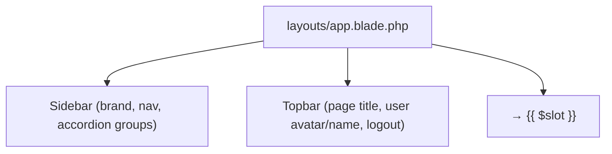

# UI Reference

The UI is **server-rendered Blade** with a hand-written CSS design system. There is
no Tailwind utility markup in views, no Alpine.js and no Livewire.

---

## 1. Global layout

Every authenticated page is wrapped by the anonymous Blade component
`<x-app-layout>`, whose template is `resources/views/layouts/app.blade.php`.



A page provides:

```blade
<x-app-layout>
    <x-slot name="title">Daily Activities - Personal Life Management System</x-slot>
    <x-slot name="pageTitle">Daily Activities</x-slot>

    ... page content ...
</x-app-layout>
```

### Appearance settings

The layout reads the user's `Setting` row and applies:

- **Theme** (`light` / `dark` / `system`) — injected `<style>` overrides.
- **Primary colour** (`primary_color`) — sets the `--primary-color` CSS variable.
- **Compact mode** — reduces card/summary padding via an injected style block.

So appearance is data-driven from Settings → Appearance, not hard-coded per page.

---

## 2. Navigation (sidebar)

The sidebar in `layouts/app.blade.php` contains:

- **Dashboard** (link).
- **Money Management** (accordion) → Analytics, Income, Salary, Expenses, Savings, Recurring Finance.
- **Daily Activities**, **Daily Routine**, **Habits** (direct links).
- **Personal Growth** (accordion) → Goals, Progress.
- **Important Dates** (accordion) → Calendar, Events.
- **AI Assistant** (direct link).
- **Settings** (pinned to the sidebar footer).

The active link is highlighted via `request()->routeIs('module.*')`. Accordion
sections expand automatically when one of their routes is active.

A small inline `<script>` at the end of the layout handles the mobile sidebar toggle
and the accordion open/close behaviour (no external JS library).

---

## 3. Page inventory

Views live in `resources/views`. The main folders:

| Folder                                                                   | Pages                                                                  |
| ------------------------------------------------------------------------ | ---------------------------------------------------------------------- |
| `dashboard.blade.php`                                                    | Dashboard (with AI widget)                                             |
| `auth/`                                                                  | `login`, `register`                                                    |
| `money-management/`                                                      | Analytics                                                              |
| `income/`, `expenses/`, `salary/`, `savings/`, `recurring-transactions/` | Finance CRUD (`index`, `create`, `edit`, plus `show` where applicable) |
| `daily-activities/`                                                      | Daily Activities journal                                               |
| `routine/`                                                               | Daily Routine (+ occurrences)                                          |
| `habits/`                                                                | Habits                                                                 |
| `goals/`                                                                 | Goals                                                                  |
| `progress/`                                                              | Personal Progress                                                      |
| `events/`                                                                | Events                                                                 |
| `calendar/`                                                              | Calendar                                                               |
| `settings/`                                                              | Settings pages + `settings/partials/nav.blade.php`                     |
| `ai/`                                                                    | AI Assistant (`assistant.blade.php`)                                   |
| `components/`                                                            | Blade components (incl. the app layout)                                |

The full list is enumerated in each feature doc under
[`features/`](./features/).

---

## 4. Reusable components & conventions

- **Layout component**: `<x-app-layout>` (only global wrapper).
- **Settings tabs**: `resources/views/settings/partials/nav.blade.php` — includes a
  shared, consistently rendered section nav on every settings page.

### CSS conventions (`resources/css/app.css`)

The design system uses semantic classes rather than utilities:

| Class                                                                           | Use                     |
| ------------------------------------------------------------------------------- | ----------------------- |
| `.card`, `.card-title`, `.card-subtitle`, `.card-header-flex`                   | Content panels          |
| `.summary-card`, `.summary-card-title`, `.summary-card-value`                   | Stat tiles              |
| `.dashboard-grid-5`                                                             | Responsive summary grid |
| `.data-table`, `.data-table-container`                                          | Tabular data            |
| `.btn-primary`, `.btn-secondary`, `.btn-sm`                                     | Buttons                 |
| `.form-control`, `.filter-bar`, `.filter-group`, `.filter-label`                | Forms/filters           |
| `.alert-success`, `.alert-danger`                                               | Flash/feedback          |
| `.nav-link`, `.nav-submenu`, `.submenu-link`, `.nav-accordion-toggle`           | Navigation              |
| `.badge`, `.badge-income`, `.badge-expense`, `.badge-active`, `.badge-inactive` | Status pills            |
| `.empty-state`, `.empty-state-title`                                            | Empty states            |

Theme variables (`--primary-color`, `--text-muted`, `--border-color`,
`--topbar-height`, …) drive light/dark and per-user theming.

---

## 5. JavaScript
- **`resources/js/app.js`** imports `./bootstrap` and `./alerts` (Vite entry point).
- **`resources/js/bootstrap.js`** boots axios (Laravel default).
- **`resources/js/alerts.js`** powers the global alert system (toasts + confirmation
  modal). See [UI/ALERTS_AND_NOTIFICATIONS.md](./UI/ALERTS_AND_NOTIFICATIONS.md).
- **Inline `<script>` blocks** in `layouts/app.blade.php` (sidebar/accordion) and in
  `ai/assistant.blade.php` (chat: `fetch` to `ai.assistant.ask`, suggestion chips,
  conversation delete). The AI chat uses the CSRF token from the page and renders
  bubbles client-side — no framework.

---

## 6. Responsive behaviour

- The sidebar is fixed on desktop; on mobile it slides in via the `#sidebarToggle`
  button with a backdrop (`#sidebarBackdrop`).
- Summary grids use `repeat(auto-fit, minmax(…, 1fr))` so tiles reflow on narrow
  screens.
- `.data-table-container` provides horizontal scroll for wide tables.

---

## 6b. Global alerts (toasts + confirmation modal)

Flash messages and destructive-action confirmations are handled by one global system,
loaded once from `layouts/app.blade.php`:

- `<x-toast />` renders `status`/`success`/`error`/`warning`/`info` flash messages as
  stacked, auto-dismissing toasts (top-right; full-width on mobile).
- `<x-confirm-modal />` is a single reusable dialog driven by `data-confirm*`
  attributes on forms/buttons (replaces the old native `confirm()`).

Full guide: [UI/ALERTS_AND_NOTIFICATIONS.md](./UI/ALERTS_AND_NOTIFICATIONS.md).

---

## 7. AI UI

- **AI Assistant page**: `resources/views/ai/assistant.blade.php` — conversation
  list, chat window, suggestions, model/health footer; gracefully shows a notice when
  AI is disabled or unhealthy.
- **Dashboard widget**: a small **Ask AI** panel injected into `dashboard.blade.php`,
  only rendered when `config('ai.enabled')` is true and wrapped in a `try/catch` so
  it can never break the dashboard.
- **Settings → AI Status**: `resources/views/settings/ai.blade.php` — model names,
  vector driver/count, last reindex, hardware and a setup checklist.

See [features/AI_ASSISTANT.md](./features/AI_ASSISTANT.md) and [AI.md](./AI.md).
