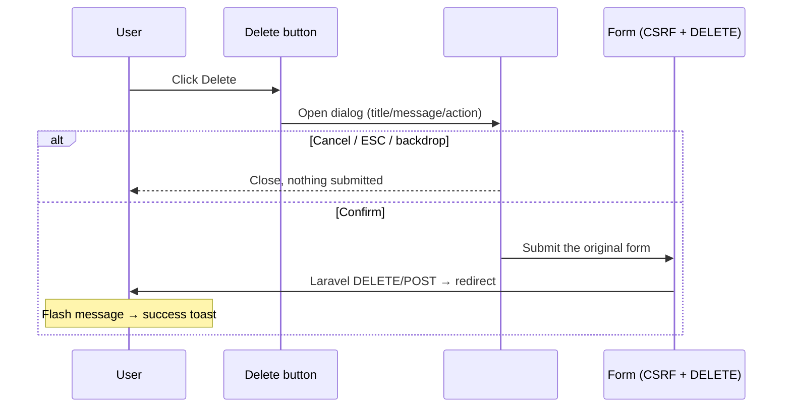

# Alerts & Notifications

The **global alert system** centralizes every user-facing notification in the Life
Management System: success/error/warning/info toasts and a reusable confirmation
modal for destructive actions.

It is loaded once in the main layout and available on **every** authenticated page,
so no page needs its own alert or modal markup.

> **STATUS: DISABLED.** The alert system is currently **not mounted globally**. Its
> files are preserved on disk, but `<x-toast />` / `<x-confirm-modal />` are not
> rendered and `resources/js/alerts.js` is not imported, so the application behaves
> as it did before the alert integration. The `data-confirm*` attributes on forms
> remain inert (they do nothing while the module is unloaded). See
> `docs/CHANGELOG.md` for the restoration note.

---

## 1. Architecture

```
Session flash (Laravel)                 data-* attributes (Blade)
        │                                        │
        ▼                                        ▼
<x-toast />  ──────────┐              <x-confirm-modal />  ──────────┐
 (renders data-toasts) │               (one dialog, reused)         │
        │              │                        │                   │
        └──────► resources/js/alerts.js ◄───────┘                   │
                 (toasts + confirm logic)                          │
                        │                                           │
                        ▼                                  resources/css/app.css
                   #toastContainer                        (.toast*, .confirm*,
                   #confirmModal                           .sr-only, dark, motion)
```

- **`resources/views/components/toast.blade.php`** — serializes server flash messages
  into `#toastContainer[data-toasts]`.
- **`resources/views/components/confirm-modal.blade.php`** — a single dialog, reused
  for every confirmation.
- **`resources/js/alerts.js`** — vanilla JS (no framework) that renders/auto-dismisses
  toasts, drives the modal, and exposes `window.Alerts`.
- **`resources/css/app.css`** — toast + modal styles built on the project's existing
  design tokens.
- Both components are included once, in **`resources/views/layouts/app.blade.php`**.

> This project uses a hand-written CSS design system (not Tailwind) and no Alpine.js.
> The alert system matches that architecture and adds **no new dependencies**.

---

## 2. Toast types

| Type      | Icon | Default auto-dismiss | Flash key                                   |
| --------- | ---- | -------------------- | ------------------------------------------- |
| `success` | ✓    | 4 s                  | `status` (existing convention) or `success` |
| `info`    | i    | 5 s                  | `info`                                      |
| `warning` | ⚠    | 6 s                  | `warning`                                   |
| `error`   | !    | 7 s                  | `error`                                     |

Info/warning/error use distinct border + icon colours (never colour alone — each
toast carries a screen-reader type label).

---

## 3. Flash message usage (server side)

```php
// Success — both of these work and render as a success toast.
return redirect()->route('income.index')->with('status', 'Income added successfully.');
return redirect()->route('income.index')->with('success', 'Income added successfully.');

// Other types.
return back()->with('error', 'Something went wrong.');
return back()->with('warning', 'Please review this information.');
return back()->with('info', 'Your changes are being processed.');
```

The **`status`** key is the project's original convention and is treated as a
success toast, so existing controllers keep working unchanged.

### Validation errors

Laravel's field-level validation errors are **never hidden**: they continue to render
inline as before. In addition, when validation fails the toast system shows a single
friendly summary:

> Please correct the highlighted fields and try again.

(It does not replace the detailed messages.)

---

## 4. Confirmation modal usage

Any element that performs a **destructive or important** action can ask for
confirmation by adding `data-confirm` (plus optional copy overrides). The most common
case is a delete form:

```blade
<form method="POST" action="{{ route('income.destroy', $income) }}"
      data-confirm
      data-confirm-title="Delete income record?"
      data-confirm-message="Are you sure you want to delete this income record? This action cannot be undone."
      data-confirm-action="Delete">
    @csrf
    @method('DELETE')
    <button type="submit" class="btn-danger-sm btn-sm">Delete</button>
</form>
```

Nothing else changes: the form still submits normally with its **CSRF token** and
**HTTP method**. The modal is purely a UX layer.

### Attributes

| Attribute              | Required | Default                         | Purpose                                                                         |
| ---------------------- | -------- | ------------------------------- | ------------------------------------------------------------------------------- |
| `data-confirm`         | yes      | —                               | Marks the element (or its owning form) as needing confirmation. Valueless flag. |
| `data-confirm-title`   | no       | `Are you sure?`                 | Dialog heading.                                                                 |
| `data-confirm-message` | no       | `This action cannot be undone.` | Dialog body text.                                                               |
| `data-confirm-action`  | no       | `Confirm`                       | Label of the confirm button.                                                    |
| `data-confirm-variant` | no       | `danger`                        | `danger` (red) or `primary` (blue) confirm button.                              |
| `data-confirm-form`    | no       | —                               | For a standalone button, the `id` of the form to submit.                        |

A **standalone button** (not inside a form) can be used too:

```blade
<button type="button"
        data-confirm
        data-confirm-title="Sign out?"
        data-confirm-message="You will be returned to the login screen."
        data-confirm-action="Sign out"
        data-confirm-variant="primary"
        onclick="...">
    Sign out
</button>
```

### JS-driven actions

For actions performed in JavaScript (e.g. a `fetch()` DELETE), use the programmatic
API instead of the browser's `confirm()`:

```js
window.Alerts.confirm(
    {
        title: "Delete conversation?",
        message: "Are you sure? This action cannot be undone.",
        action: "Delete",
    },
    function () {
        fetch(url, { method: "DELETE", headers: { "X-CSRF-TOKEN": token } });
    },
);
```

---

## 5. Delete flow



The confirmation is **UX only** — server-side authorization, policies, middleware and
validation remain the real security boundary.

---

## 6. Component locations

| File                                                 | Role                                                      |
| ---------------------------------------------------- | --------------------------------------------------------- |
| `resources/views/components/toast.blade.php`         | Toast container + flash serialization                     |
| `resources/views/components/confirm-modal.blade.php` | The single confirmation dialog                            |
| `resources/js/alerts.js`                             | Toast + modal behaviour, `window.Alerts` API              |
| `resources/css/app.css`                              | `.toast*`, `.confirm*`, `.sr-only`, dark + reduced-motion |
| `resources/views/layouts/app.blade.php`              | Includes `<x-toast />` and `<x-confirm-modal />`          |
| `resources/js/app.js`                                | Imports `./alerts`                                        |

---

## 7. JavaScript behaviour

- **Toasts**: created on load from `#toastContainer[data-toasts]`, animated in,
  auto-dismissed after the per-type duration, removable via the × button. At most
  `maxToasts` (4) are visible; the oldest is removed first. Timers are cleared when a
  toast is closed manually (no leaks).
- **Modal**: a single `#confirmModal`. It opens on the first `submit` of a
  `data-confirm` form or a `click` on a `data-confirm` control, stores the trigger,
  and on **Confirm** re-submits that trigger with a one-shot bypass flag so the
  interception does not loop.
- **Accessibility**: focus moves to the confirm button on open and returns to the
  trigger on close; `Escape` closes; the dialog uses `role="alertdialog"` +
  `aria-modal`; toasts use `role="status"` (or `role="alert"` for errors) inside a
  polite `aria-live` region.
- **Public API** (`window.Alerts`):

    ```js
    Alerts.success(message, durationMs?)   // duration omitted = use default
    Alerts.error(message)
    Alerts.warning(message)
    Alerts.info(message)
    Alerts.confirm({ title, message, action, variant }, onConfirm)
    Alerts.config                          // the CONFIG object (read-only intent)
    ```

> Note: a toast shown programmatically with a `durationMs` of `null`/`0` stays until
> dismissed.

---

## 8. Styling approach

The alert system uses the same tokens as the rest of the app
(`--primary-color`, `--success-color`, `--danger-color`, `--surface-color`,
`--border-color`, `--text-main`, `--text-muted`, radii and shadows), so it looks
native to the Life Management System and follows the existing theme.

- Toasts are **top-right**, stacking vertically; on screens ≤ 640 px they span the
  width under the top edge so they never overflow the viewport.
- The container is `position: fixed; z-index: 2000` and the modal `2100`, so they sit
  above normal content. The container uses `pointer-events: none` (only the toasts
  themselves are interactive), so notifications never block the page.
- **Dark mode**: dark rules exist for `.dark-mode` / `[data-theme="dark"]` contexts
  and the layout's dark theme.
- **Reduced motion**: all transitions are disabled under
  `@media (prefers-reduced-motion: reduce)`.

---

## 9. Accessibility rules

- Toast type is conveyed by an icon **and** a visually-hidden label (`.sr-only`), not
  by colour alone.
- Toast close button has `aria-label="Dismiss notification"`.
- Modal is a proper `alertdialog` with `aria-labelledby` / `aria-describedby`, a
  focusable confirm/cancel pair, visible focus rings, ESC-to-close and focus restore.
- All interactive controls are keyboard reachable.

---

## 10. How a future developer should use it

1. **After a successful action** in a controller, flash a message:
   `->with('status', 'Thing saved successfully.')`.
2. **For a destructive action**, add `data-confirm*` attributes to the form (or button)
   — do **not** add `onsubmit="return confirm(...)"`.
3. Never write a new modal or a new toast container; reuse the globals.
4. Keep CSRF (`@csrf`) and the HTTP verb (`@method(...)`) untouched.

---

## 11. Customizing duration

Edit the `CONFIG.durations` map in `resources/js/alerts.js`:

```js
const CONFIG = {
    durations: { success: 4000, info: 5000, warning: 6000, error: 7000 },
    maxToasts: 4,
    closeConfirmOnBackdrop: true,
};
```

Then rebuild assets (`npm run build` or `npm run dev`). A per-call override is
available: `window.Alerts.success('Saved', 8000)`.

---

## 12. Customizing messages

- Server side: change the text passed to `with(...)`.
- Per action: change the `data-confirm-title` / `data-confirm-message` /
  `data-confirm-action` attributes.
- Defaults (when attributes are omitted) live in `resources/js/alerts.js`
  (`openConfirm`).

---

## 13. Adding a new alert type

1. Add a duration in `CONFIG.durations` (optional).
2. Add an icon in the `ICONS` map and a label in `TYPE_LABELS` in
   `resources/js/alerts.js`.
3. Add `.toast-<type>` colour rules in `resources/css/app.css` (mirror an existing
   type).
4. (Optional) Add the type to the `foreach` list in
   `resources/views/components/toast.blade.php` so a matching session key is picked up
   automatically.
5. Rebuild assets.

---

## 14. Verification performed

A live browser check confirmed, with **no console errors and no failed requests**:

- success and warning toasts render from server flash data and stack;
- a warning/info toast from `window.Alerts` renders;
- manual close removes a toast;
- a `data-confirm` form submit opens the modal with the configured title/copy and is
  prevented from submitting until confirmed;
- Cancel / ESC close the modal without submitting;
- Confirm submits the underlying form (preserving its CSRF token and method).

All Personal Workspace pages continue to load (existing smoke tests pass).
