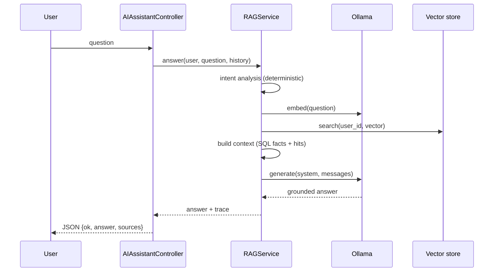

# AI Assistant

## 1. Purpose

A **100% local, privacy-first** conversational assistant that answers natural-language
questions about the user's own Personal Workspace data using Retrieval-Augmented
Generation (RAG). No paid AI API and no API key are required.

For the architecture deep-dive, see [../AI.md](../AI.md). This page focuses on the
feature as a user/developer sees it.

## 2. Current Status

Implemented (local Ollama + Qdrant/MySQL fallback + full RAG pipeline + persistent
conversations + health checks).

## 3. User Flow

1. Sidebar → **AI Assistant** (`/ai/assistant`).
2. Type a question (or pick a suggestion chip) and send.
3. The answer appears in the chat; the conversation is saved.
4. Past conversations appear in the left list and can be reopened or deleted.
5. The dashboard also shows an **Ask AI** widget linking here.

Example questions the assistant supports:

```
What did I do today?
What did I do during the last 7 days?
What goals am I currently working on?
How is my goal progress?
Which habits have I been consistent with?
What events do I have this week?
How much did I spend this month?
What were my biggest expense categories?
What income did I receive this month?
Summarize my week.
Find activities related to learning programming.
```

## 4. UI

- **Pages**:
    - `resources/views/ai/assistant.blade.php` — chat (conversation list, chat window,
      suggestions, model/health footer, graceful notices).
    - `resources/views/settings/ai.blade.php` — AI status.
    - `resources/views/dashboard.blade.php` — the **Ask AI** widget.
- **Routes**: `ai.assistant`, `ai.assistant.ask`, `ai.conversations.destroy`,
  `settings.ai`.
- **Components**: shared CSS classes; the chat is driven by a small inline `<script>`
  using `fetch()` (no JS framework).

## 5. Backend

- **Controller**: `App\Http\Controllers\AIAssistantController` — `index`, `ask`
  (JSON), `destroy`.
- **Service layer**: `app/Services/AI/**` — `RAGService` (orchestrator),
  `IntentAnalyzer`, `ContextBuilder`, `IndexingService`, `AIHealthService`,
  `AIPrivacyService`, domain services (`FinanceAIService`, `GoalAIService`,
  `HabitAIService`, `ActivityAIService`, `EventAIService`, `ProgressAIService`),
  providers (`OllamaAIProvider`, `OllamaEmbeddingProvider`, …), vector stores
  (`QdrantVectorSearch`, `DatabaseVectorRepository`, …), `Ollama/OllamaClient`,
  `Ollama/ModelSelector`, `Hardware/HardwareDetector`.
- **Container wiring**: `app/Providers/AIServiceProvider.php` binds the interfaces and
  registers the embedding-sync observers.
- **Models**: `AiConversation`, `AiMessage`, `AiEmbedding`, `AiSetting`,
  `AiTrainingSample` (unused).
- **Jobs**: `App\Jobs\AI\SyncEmbeddingJob`.
- **Observer**: `App\Observers\AI\EmbeddingObserver`.
- **Commands**: `ai:reindex`, `ai:health`.

## 6. Database

`ai_conversations`, `ai_messages`, `ai_embeddings`, `ai_settings`
(+ unused `ai_training_samples`). These are **derived** — MySQL personal records are
authoritative. See [DATABASE.md](../DATABASE.md).

## 7. Business Rules

- The **LLM never queries the DB and never computes money.** Laravel retrieves and
  computes; the model explains.
- Every retrieval is scoped to the authenticated user.
- If data is insufficient, the assistant must say so rather than invent content.
- Financial figures come from SQL; only textual finance fields are semantically indexed.
- Multiple currencies are never summed; no exchange rate is invented.

## 8. Validation

- `question`: required, string, max `AI_MAX_QUESTION_CHARS` (default 2000).
- `conversation_id`: optional integer, must belong to the user.
- Per-user rate limit: `AI_RATE_LIMIT_PER_MINUTE` (default 20/min).

## 9. Permissions & Security

- All AI routes require `auth`.
- `{conversation}` is a **scoped route binding** (404 for foreign ids);
  `AiConversationPolicy` additionally guards deletion.
- Vectors carry `user_id`; searches filter on it and re-check the payload owner.
- Untrusted text is sanitised and fenced (`<<DATA … DATA>>>`); the system prompt treats
  it strictly as data (prompt-injection defence).
- No API keys are stored or displayed.

## 10. Data Flow



## 11. File Map

| Concern         | Files                                                                                                               |
| --------------- | ------------------------------------------------------------------------------------------------------------------- |
| Controller      | `app/Http/Controllers/AIAssistantController.php`                                                                    |
| Orchestration   | `app/Services/AI/RAGService.php`, `IntentAnalyzer.php`, `ContextBuilder.php`                                        |
| Indexing        | `app/Services/AI/IndexingService.php`, `app/Jobs/AI/SyncEmbeddingJob.php`, `app/Observers/AI/EmbeddingObserver.php` |
| Providers       | `app/Services/AI/Providers/*`, `app/Services/AI/Ollama/*`, `app/Services/AI/Hardware/HardwareDetector.php`          |
| Vector          | `app/Services/AI/Vector/*`                                                                                          |
| Domain services | `app/Services/AI/Services/*`                                                                                        |
| Health          | `app/Services/AI/AIHealthService.php`                                                                               |
| Privacy         | `app/Services/AI/AIPrivacyService.php`                                                                              |
| Views           | `resources/views/ai/assistant.blade.php`, `resources/views/settings/ai.blade.php`                                   |
| Commands        | `app/Console/Commands/AI/{ReindexCommand,AIHealthCommand}.php`                                                      |
| Docs            | `AI_LOCAL_SETUP.md`, `docs/AI.md`                                                                                   |

## 12. AI Integration

This **is** the AI integration. Indexed sources: Daily Activities, Goals, Goal
Progress, Habits, Events, and textual finance fields. Routine is not indexed.

## 13. Known Limitations

- Routine data is not indexed.
- CPU-only inference is slow for larger models.
- Answers depend on the quality/size of the selected local model.
- Fine-tuning scaffolding is unused.

## 14. Future Improvements (planned)

- Index routine data; add an inline dashboard answer card; streaming responses.

## 15. Change History

- Initial audit and documentation (2026-09-20).
- Removed dead duplicates (`QuestionClassifier`, the `EmbeddingService` facade).
